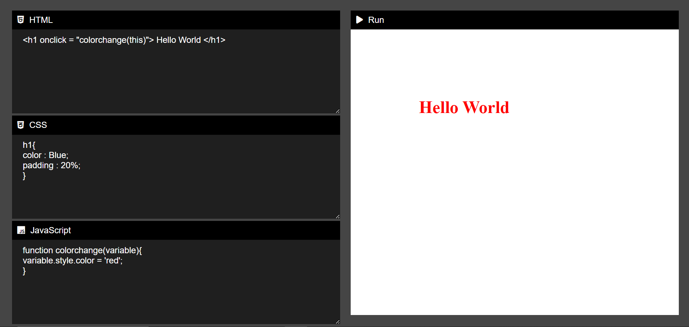

# CodEdi - Code Editor for Building Static Websites
CodEdi is a user-friendly online code editor that allows you to create static websites using HTML, CSS, and JavaScript. With CodEdi, you can experiment with your code in real-time, preview the results instantly, and save your projects for future reference.

# Features
Code Editing: Write and edit HTML, CSS, and JavaScript code in the built-in code editor.
Live Preview: See the live preview of your website as you write code.
Responsive Design: CodePlay provides a responsive design to preview your website on different devices.

# Technologies Used
HTML
CSS
JavaScript

# Getting Started
To start using CodEdi, follow these simple steps:

Open your web browser and navigate to CodEdi.

You will see an editor area split into three sections (HTML, CSS, and JavaScript). Write your code in the respective sections.

As you write your code, the live preview on the right side will update in real-time.

Use the responsive design buttons to preview how your website looks on different devices (e.g., desktop, tablet, mobile).

